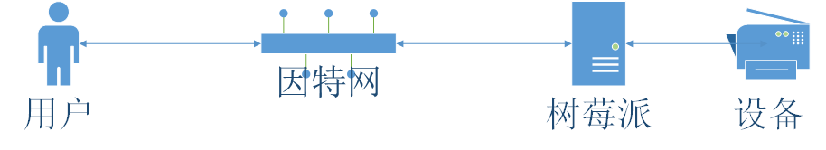

# 道LOT tao-lot
道LOT基于树莓派，是史上最简单的物联网系统之一。<br>
道LOT基于springboot，自动打TCP隧道，也就是让用户可以远程点对点操作物联网设备。<br>
道LOT通过application.properties配置文件进行配置，配置tcp隧道端口如下
```
upnp.externalPort=8088
```
道LOT启动并成功打通TCP隧道后，会自动发有奖把树莓派设备的公网ip与映射端口号到到指定的邮箱，配置如下：
```
spring.mail.host= smtp.qq.com
spring.mail.port= 465
spring.mail.username = xxxxxxxx@qq.com
spring.mail.password = xxxxxxxxxxxxxxx
```
道LOT利用Pi4j来控制树莓派，非常简单。可参考 [pi4j](http://pi4j.com/)<br>
道LOT的Controller是个简单的例子，主要功能有查看TCP映射信息与打开关闭led灯泡。用户可以很方便的进行扩展。<br>
最后附上架构图


